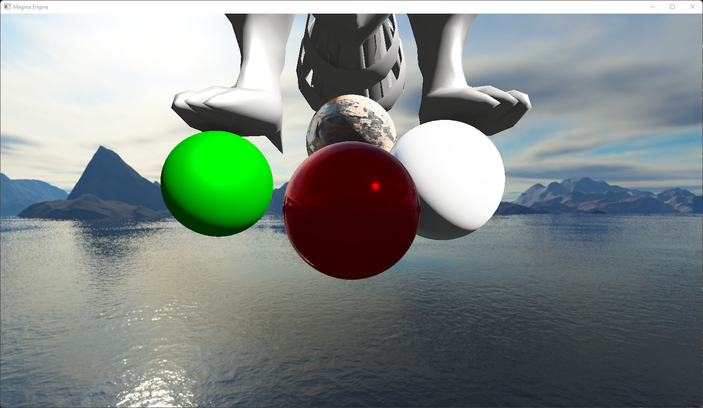

# Magma
Magma Engine is a rendering engine which I started doing while I'm studying a Computer Graphics Masters Degree.

## The idea
The idea behind this project is to create a render engine focused on both performance and ease of use. Those two main feautes take inspiration from [Wicked Engine](https://wickedengine.net/) and [Hazel Engine](https://hazelengine.com/) respectively.

This engine also has been used for one of the assigments I had to done, where I implemented some rendering techniques (Depth prepass, SSAO, Physically Based Rendering, Skybox rendering...) and tested the rendering API abstraction at that moment.

### Main features to come:
- Operating System Independence
- Graphics API agnostic (**Vulkan**, DirectX 12)
- Window System agnostic (**GLFW**, SDL, Win32)
- Good rendering performance
- Ease of use of the rendering layer 
- Ease of implementing new rendering and lighting techniques

## Requirements
- [Vulkan SDK](https://vulkan.lunarg.com/): The main API to be supported by Magma Engine is Vulkan
- OS: [Windows](https://www.microsoft.com/es-es/windows) (Magma Engine only has been executed on Windows at the moment)
- [Visual Studio 2022](https://visualstudio.com) (not strictly required, however included setup scripts at the moment only support this)

## Basic setup
Once you've cloned this repository using the command:

	git clone https://github.com/Frollo24/Magma

Run `Scripts/SetupVS2022.bat` if you're using Visual Studio 2022 to generate correct Visual Studio solution and project files.